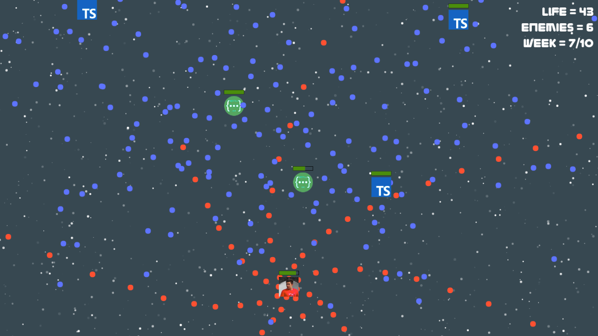
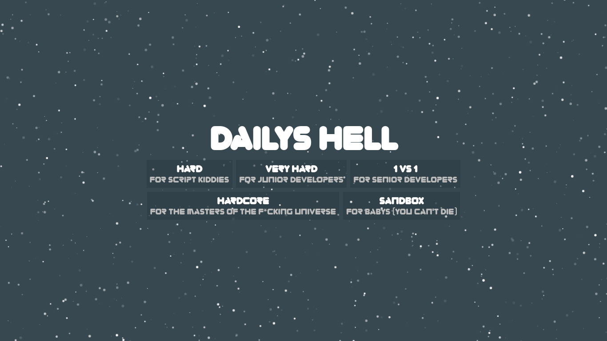
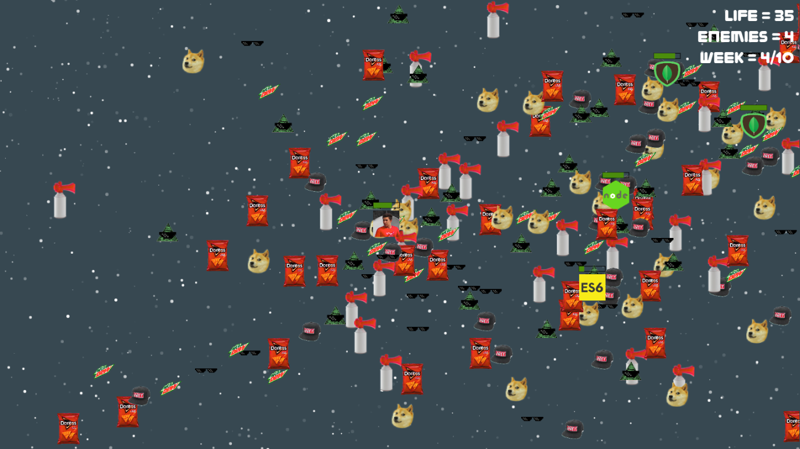

# [Dailys Hell](https://monkeyandres.github.io/Dailys-Hell/)

**Dailys Hell** es un juego del genero "bullet hell", esto quiere decir que es un juego en el que tanto el player como los enemigos disparan balas en **todas las direcciones** y el objetivo es matar a los enemigos con tus balas antes de que te maten a ti. 

Este juego fue realizado unicamente en **una semana** y esta basado en el bootcamp de **Desarrollo Web** de **IronHack**, el cual esta dividido en 9 semanas y un prework. La idea de este juego se me ocurrio porque queria hacer una experiencia jugable de como se siente hacer el bootcamp de Desarrollo Web de IronHack.



### Features

* Algoritmo de **optimizacion** de particulas matiene el juego con un rendimiento optimo
* Algoritmo de colisiones "pixel perfect" es decir **colisiones 100% reales**
* **Clean Code:**  esta desarrollado siguiendo los patrones de codigo limpio y modularizacion
* **Fondo** del juego **animado**, el fondo del juego esta realizado con una implementacion de una libreria visual de JS llamada "Particles JS"
* Las **balas** tienen una **trayectoria radial** que les da un extra de dificultad tanto como para dispararlas como para esquivarlas
* **Contador** de vida, nivel y enemigos restantes en tiempo real
* **Indicador de vida animado en tiempo real** en el jugador principal y en los enemigos
* Enemigos con **movimiento y velocidad aleatoria**
* Cuando el jugador principal sale por un extremo de la pantalla aparece en el extremo opuesto
* Al tocar con el borde de la pantalla los enemigos rebotan
* Parametros del juego definidos aparte, si deseas cambiar parametros del juego como los enemigos por nivel o los sprites de los enemigos puedes hacerlo en el archivo `gameData.js`
* **Pantallas** que indican el **paso de nivel** y curan a tu jugador principal. Aparte de pantalla de Game Over y selector de dificultades.
* Tiene un **jefe final** como ultimo nivel
* Imagenes **comprimidas** para mas rendimiento
* [Easter Egg](#easteregg)

### Dificultades 
Como añadido tienes varias dificultades para pasarte el juego: 



Cada una de estas dificultades **cambia** ciertos **parametros** del juego como la **vida** de los enemigos, del personaje principal y la **velocidad** a la que disparan los enemigos o incluso si al pasar de nivel tu personaje se **cura** o no.

### Enemigos
Siguiendo la temática del Desarrollo Web los enemigos son las diferentes **tecnologias** y **proyectos** que se aprenderan durante el bootcamp. Lista de enemigos:
* **Prework**: Rover, npm.
* **Week 1:** HTML, CSS, JS
* **Week 2:** Bootstrap, JQuery, SASS, FlappyBird
* **Week 3:** CodeWars (katas)
* **Week 4:** NodeJS, ExpressJS, MongoDB, ES6
* **Week 5:** Passport, Google Maps, AJAX, Nodemailer, Heroku
* **Week 6:** Codewars, Lodash, Git
* **Week 7:** TypeScript, Angular, API REST
* **Week 8:** (Los TA's de mi bootcamp)
* **Final Boss:** Marc (el profesor principal del bootcamp)

### EasterEgg

Una vez seleccionada la dificultad del juego y con el juego iniciado puedes dentro de la **consola** del navegador ejecutar el siguiente codigo y todas las balas del juego cambiaran **automaticamente** por objetos random como Doritos, MtnDew, Gorras de Obey, Simbolos de illuminati, Airhorns y el perrete Doge.

```javascript
game.mlgMode = true
```

